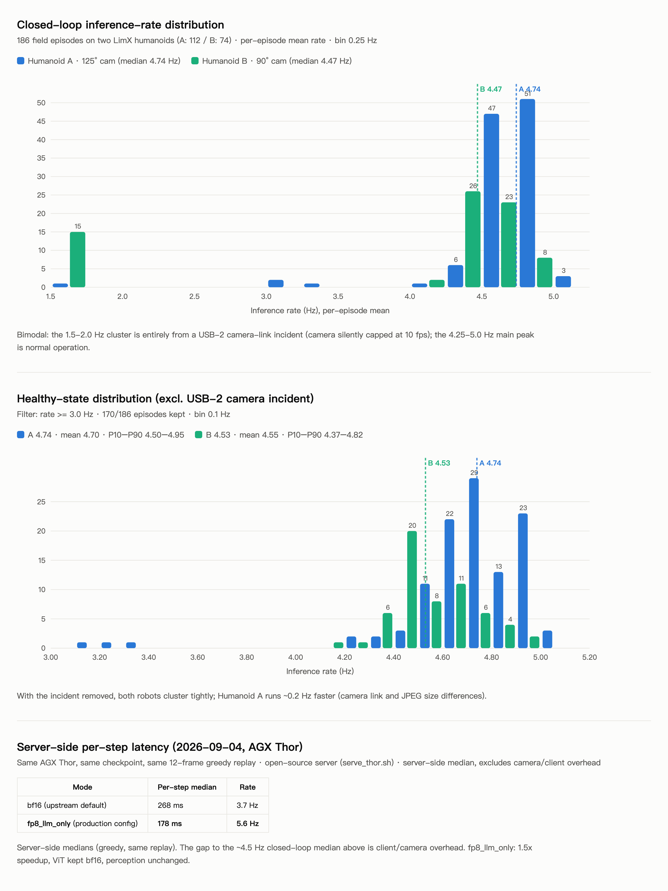

# 在 NVIDIA Jetson AGX Thor 上部署 LightNav-0 推理服务

[English](JETSON_THOR.md)

在机器人**自带的 Jetson AGX Thor**(SM 11.0,统一内存)上直接运行
`lightnav-serve` 的实战笔记,而非远程 GPU 主机。以下内容均来自 LimX 人形机器人的
日常实测:机器人侧客户端与服务端同板,连接 `ws://127.0.0.1:8050`,Wi-Fi 掉线
不会中断控制。

配套启动器:[`scripts/serve_thor.sh`](../scripts/serve_thor.sh)。

## 安装(aarch64)

* CUDA 相关包请使用 NVIDIA Jetson wheel 渠道——PyPI 没有 aarch64+CUDA 构建。
  aarch64 部署组合:`torch==2.10.0+cu130`、`torchvision==0.25.0+cu130`、
  `torchaudio==2.10.0+cu130`、`vllm==0.19.1`(下面的 fp8 补丁绑定 vLLM 私有量化
  接口,故锁定该 patch 版本——换一个版本都可能漂移)。
* cu13 版 torch 需要其自带的 NVIDIA 库排在系统库之前,否则 `import torch`
  可能因 nvJitLink 符号未定义而崩溃:

  ```bash
  # 冒号分隔的 LD_LIBRARY_PATH 不能包含未展开的通配符——逐目录构建
  for d in "$VENV"/lib/python*/site-packages/nvidia/*/lib; do
      [ -d "$d" ] && export LD_LIBRARY_PATH="$d:${LD_LIBRARY_PATH:-}"
  done
  ```

  (`serve_thor.sh` 会自动处理。)
* 离线机器人:在工作机预下载轮子到 wheelhouse,再
  `pip install --no-index --find-links` 安装。同时导出
  `VLLM_NO_USAGE_STATS=1 DO_NOT_TRACK=1`——vLLM 引擎启动时会发遥测,
  无外网时该请求会卡启动。

## fp8 推理(`--quantization fp8_llm_only`)

引擎默认以 bf16 加载;`--quantization fp8_llm_only`(环境变量 `VLLM_QUANT`)会**只对 LLM 部分**做动态 fp8
量化,`visual.*` 所有线性层保持 bf16
(`lightnav.inference.vllm_utils._patch_fp8_llm_only`)。AGX Thor 单会话、
同一段贪心回放的服务端单步中位:

| 模式 | 单步 | 频率 |
|---|---|---|
| bf16(默认) | 268 ms | 3.7 Hz |
| `fp8_llm_only` | **178 ms** | **5.6 Hz** |

`serve_thor.sh` 检测到 Thor 时自动启用(`VLLM_QUANT= bash scripts/serve_thor.sh`
可退回 bf16)。加载器拒绝全模型 `fp8`:量化 ViT 会**破坏感知**
(348 步跟踪回放中 visible 翻转 91 次、stop/go 翻转 121 次),且因动态量化
开销主导小 GEMM,ViT 反而**慢约 2 倍**。LLM-only 与 bf16 接近等价
(stop 决策一致率 97.4%,waypoint 位移 p50 4.4 cm)。

### SM 11.0 内核陷阱

Thor 上的 fp8 需要一道守卫(`serve_thor.sh` 自动设置):vLLM 有三个线性层内核
只编译了 SM 10.0 家族,在 SM 11.0 上会**以设备端 trap 杀掉 CUDA context**:

```bash
export VLLM_DISABLED_KERNELS=MarlinFP8ScaledMMLinearKernel,FlashInferFP8ScaledMMLinearKernel,CutlassFP8ScaledMMLinearKernel
```

禁用后 vLLM 回落到逐张量 `torch._scaled_mm`(cuBLASLt)路径,结果正确,
且仍有上表加速。

编译缓存污染:若已加守卫仍出现 `This kernel only supports sm100f`,是修复前
trace 的 `torch.compile` 图被重放——清空 `~/.cache/vllm/torch_compile_cache`
后重启。

## 统一内存的坑

* Jetson 上 `nvidia-smi --query-gpu=memory.used` 返回 `[N/A]`——等待显存释放的
  重启脚本必须回退到进程检查(`serve_thor.sh --stop` 已处理)。
* GPU 与 CPU 共享一个 LPDDR 池。`--gpu_memory_utilization` 要按**系统其余部分
  的需要**预算,而不是按固定显存大小;我们导航模型用 `0.60`,余量留给系统、
  机器人栈和可选的共存服务(见下)。
* 开录制的服务端在收到信号后要先落盘 episode 分段才释放内存——必须等旧进程
  真正退出后再启动新的,否则新引擎会在空闲内存检查处失败。

## ViT tubelet 缓存容量

SlowFast 历史每步重编码复现 tubelet;`lightnav.inference.vit_cache` 的 LRU
让命中步从冷启 ~51 ms 降到 ~34 ms(Thor 实测)。默认容量(SlowFast 512)
约覆盖 4 Hz 下两分钟会话——超过后 mid/span 层的复现 tubelet 会在复用前被逐出,
每步 miss 从 ~1.0 涨到 ~3.4。长时间机器人 episode 建议 1024
(0.60 显存预算下 ~5 分钟会话保持平稳;同预算下 2048 放不下)。
启动器不改引擎默认值,按需为单次运行开启:

```bash
export VLN_VIT_CACHE_ENTRIES=1024
```

非整数值会在启动时报错退出;数值下限钳制为 32。

## 共存其他 GPU 服务(可选)

小模型可以和导航共板。我们跑过中文语音 → 英文指令的链路
(Qwen3-ASR-0.6B `gpu_memory_utilization 0.10` + Qwen2.5-3B 翻译 `0.15`,
导航留 `0.60`;导航满速运行时每句话 ≈0.6 s)。唯一要紧的规则:
**先起小模型**,让大引擎的空闲内存检查看到稳定的内存池。

## 实测吞吐

640×360 输入、64 帧 SlowFast 历史、单会话、AGX Thor。服务端两行为 12 帧贪心回放、本仓库代码
经 `scripts/serve_thor.sh` 启动实测(2026-09);闭环行来自同一引擎+量化配置在
LimX 人形上数月的生产部署:

| 配置 | 单步中位 | 频率 |
|---|---|---|
| bf16,服务端 | 268 ms | 3.7 Hz |
| `fp8_llm_only`,服务端 | **178 ms** | **5.6 Hz** |
| `fp8_llm_only`,完整闭环(相机 → 客户端 → 服务端 → MPC) | — | 4.5–4.8 Hz |

186 个实测 episode 的逐条闭环频率分布(含一次 USB-2 相机降速事故的前后对照):



闭环频率是客户端同板时机器人真实拿到的速率;4.5 Hz 下该栈以最高 1.5 m/s
跟人、找物。最后一条来自现场的忠告:**未被发现的相机降速压倒一切模型侧优化**
——USB-2 链路会让 Orbbec 默认档位静默掉到 10 fps,推理率减半、转弯失稳。
调模型前先用 `lsusb -t` 确认相机枚举在 5000M。
